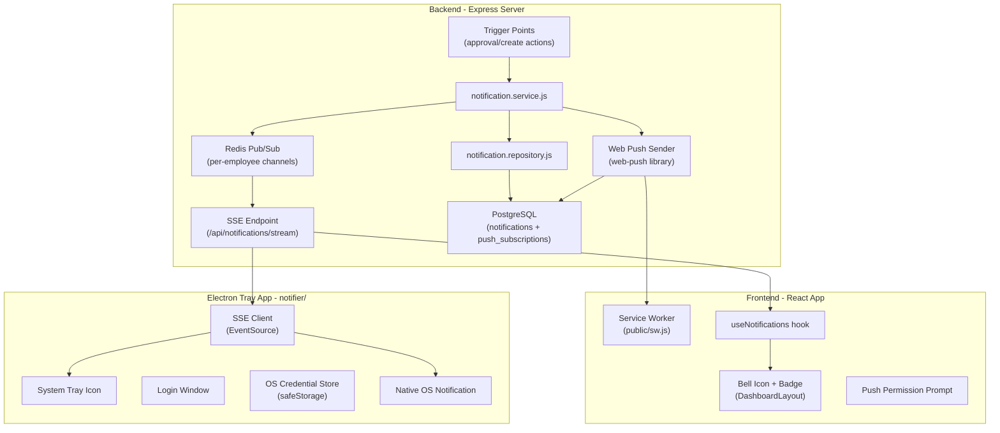
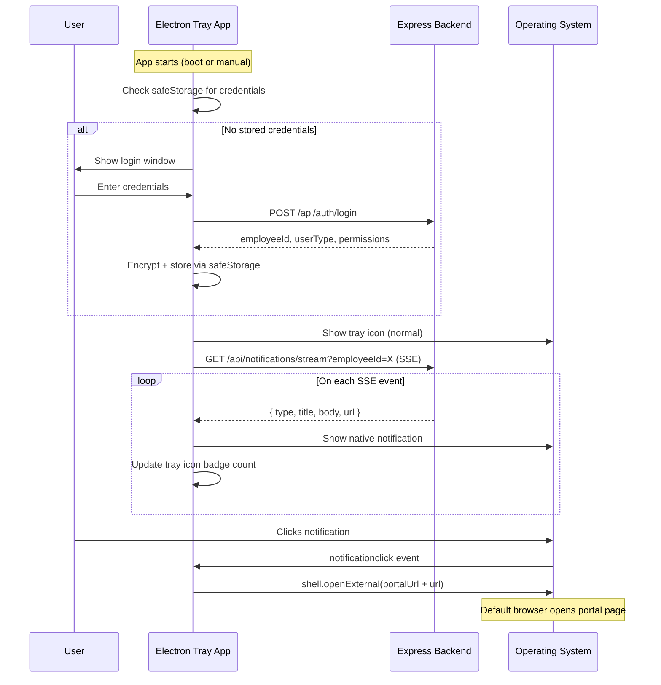

# Cross-Platform Real-Time Notification System

## Architecture Overview




## Existing Infrastructure We Leverage

- **Redis** already configured in `config/bullmq.js` (ioredis, `REDIS_HOST`, `REDIS_PORT`, `REDIS_PASSWORD`)
- **BullMQ** `notifyBucketChanged` pattern already fires on requisition stage transitions in `requisition.service.js`
- **Nodemailer** already configured in `config/email.js`
- **express-session** already handles auth sessions
- **Layered architecture** (routes -> controllers -> services -> repositories) is clean and consistent

---

## PHASE 1: Backend Notification Infrastructure

### 1.1 Database Tables

Two new tables in PostgreSQL:

```sql
-- Persistent notification inbox (read/unread)
CREATE TABLE notifications (
  id SERIAL PRIMARY KEY,
  recipient_employee_id INTEGER NOT NULL,
  type VARCHAR(50) NOT NULL,
  title VARCHAR(255) NOT NULL,
  body TEXT,
  url VARCHAR(255),
  is_read BOOLEAN DEFAULT FALSE,
  related_entity_type VARCHAR(50),
  related_entity_id INTEGER,
  created_at TIMESTAMP DEFAULT NOW()
);
CREATE INDEX idx_notifications_recipient ON notifications(recipient_employee_id, is_read, created_at DESC);

-- Web Push subscriptions (one row per browser per employee)
CREATE TABLE push_subscriptions (
  id SERIAL PRIMARY KEY,
  employee_id INTEGER NOT NULL,
  subscription JSONB NOT NULL,
  user_agent TEXT,
  created_at TIMESTAMP DEFAULT NOW(),
  UNIQUE(employee_id, subscription)
);
CREATE INDEX idx_push_sub_employee ON push_subscriptions(employee_id);
```

### 1.2 New Backend Files (in the backend repo)


| File                                          | Purpose                                                                    |
| --------------------------------------------- | -------------------------------------------------------------------------- |
| `config/push.js`                              | VAPID key config, `web-push` setup                                         |
| `config/sse.js`                               | SSE connection manager (Redis pub/sub subscriber per connected client)     |
| `src/routes/notification.routes.js`           | New route file for notification endpoints                                  |
| `src/controllers/notification.controller.js`  | Controller for notification CRUD + SSE + push subscribe                    |
| `src/services/notification.service.js`        | Core: create notification, resolve recipients, publish to Redis, send push |
| `src/repositories/notification.repository.js` | SQL for notifications table + push_subscriptions table                     |
| `migrations/create_notifications_tables.sql`  | Schema migration                                                           |


### 1.3 New API Endpoints

Mount at `/api/notifications` in `app.js`:


| Method   | Path            | Purpose                                                                                                      |
| -------- | --------------- | ------------------------------------------------------------------------------------------------------------ |
| `GET`    | `/stream`       | SSE endpoint; query: `employeeId`; long-lived connection via Redis subscribe to `notifications:{employeeId}` |
| `GET`    | `/`             | List notifications for employee; query: `employeeId`, `unreadOnly`, `page`, `limit`                          |
| `GET`    | `/unread-count` | Quick badge count; query: `employeeId`                                                                       |
| `PUT`    | `/:id/read`     | Mark single notification as read                                                                             |
| `PUT`    | `/read-all`     | Mark all as read for employee                                                                                |
| `POST`   | `/subscribe`    | Save Web Push subscription; body: `{ employeeId, subscription }`                                             |
| `DELETE` | `/subscribe`    | Remove push subscription (on logout/revoke)                                                                  |


### 1.4 SSE Connection Manager (`config/sse.js`)

- Uses the existing ioredis connection from `config/bullmq.js` (or creates a dedicated subscriber instance)
- On client connect: `subscriber.subscribe('notifications:{employeeId}')`
- On Redis message: `res.write('data: ...\n\n')`
- Heartbeat every 30s to keep alive
- On client disconnect: unsubscribe + cleanup
- Track active connections in a Map for monitoring

### 1.5 Notification Service (`notification.service.js`)

Central dispatch function:

```
async function notify({ recipientEmployeeId, type, title, body, url, relatedEntityType, relatedEntityId })
```

This function:

1. Inserts row into `notifications` table
2. Publishes to Redis channel `notifications:{recipientEmployeeId}` (for SSE)
3. Sends Web Push to all `push_subscriptions` for that employee (for browser/offline)

### 1.6 Recipient Resolution

Add helper queries to `notification.repository.js`:


| Function                            | SQL Logic                                                                                                                     |
| ----------------------------------- | ----------------------------------------------------------------------------------------------------------------------------- |
| `getHodForDepartment(departmentId)` | `SELECT e.employee_id FROM employees e JOIN hod_departments hd ON hd.employee_id = e.employee_id WHERE hd.department_id = $1` |
| `getEmployeesByType(typeName)`      | `SELECT e.employee_id FROM employees e JOIN employee_type et ON e.emp_type_id = et.emp_type_id WHERE et.emp_type_name = $1`   |
| `getHrMembers()`                    | Reuse logic from `isHrMember` in `requisition.repository.js` but return all matching employee_ids                             |
| `getCommitteeMembers()`             | Same pattern for Committee type                                                                                               |
| `getCeoMembers()`                   | Same pattern for CEO type                                                                                                     |
| `getProcurementMembers()`           | Same pattern for Procurement type                                                                                             |
| `getFinanceMembers()`               | Same pattern for Finance type                                                                                                 |


### 1.7 Trigger Integration Points

Inject `notify()` calls into existing services. These are the exact files and approximate locations:

**Requisition flow** -- `src/services/requisition.service.js`:


| After This Action                          | Notify Who                                         | Type                                                     |
| ------------------------------------------ | -------------------------------------------------- | -------------------------------------------------------- |
| `createRequisition` (end of function)      | HOD of creator's department                        | `requisition_pending_hod`                                |
| `approveHod` (after `notifyBucketChanged`) | Committee / Procurement / HR (based on next stage) | `requisition_pending_committee` / `_procurement` / `_hr` |
| HOD reject                                 | Creator                                            | `requisition_rejected`                                   |
| `approveCommittee` (after notify)          | CEO or Procurement (based on amount/flow)          | `requisition_pending_ceo` / `_procurement`               |
| Committee reject                           | Creator                                            | `requisition_rejected`                                   |
| `approveCeo` (after notify)                | Procurement or Finance                             | `requisition_pending_procurement` / `_finance`           |
| CEO reject                                 | Creator                                            | `requisition_rejected`                                   |
| `approveFinance`                           | Creator (for ack) / Procurement                    | `requisition_finance_approved`                           |
| `completePurchase`                         | Creator                                            | `requisition_ready_for_receipt`                          |


**Leave flow** -- `src/services/leave.service.js`:


| After This Action                 | Notify Who                                 | Type                                     |
| --------------------------------- | ------------------------------------------ | ---------------------------------------- |
| `createLeaveRequest`              | HOD of department (or HR if self-HOD/exec) | `leave_pending_hod` / `leave_pending_hr` |
| HOD forwards to HR (`Pending HR`) | HR members                                 | `leave_pending_hr`                       |
| HOD/HR rejects                    | Requesting employee                        | `leave_rejected`                         |
| HR approves                       | Requesting employee                        | `leave_approved`                         |


**Profile flow** -- `src/services/profile.service.js`:


| After This Action                        | Notify Who          | Type                      |
| ---------------------------------------- | ------------------- | ------------------------- |
| `updateProfile` (change request created) | HR members          | `profile_change_pending`  |
| Approve                                  | Requesting employee | `profile_change_approved` |
| Reject                                   | Requesting employee | `profile_change_rejected` |


**Feedback flow** -- `src/services/feedback.service.js`:


| After This Action | Notify Who                    | Type                 |
| ----------------- | ----------------------------- | -------------------- |
| `submitFeedback`  | HR members (if not anonymous) | `feedback_submitted` |


### 1.8 New Backend Dependencies

- `web-push` -- for sending Web Push notifications (VAPID)
- No other new deps needed (ioredis already installed for BullMQ)

### 1.9 VAPID Key Generation

One-time setup: `npx web-push generate-vapid-keys` produces a public/private key pair. Store in `.env`:

```
VAPID_PUBLIC_KEY=BNx...
VAPID_PRIVATE_KEY=abc...
VAPID_SUBJECT=mailto:admin@itecknologi.com
```

---

## PHASE 2: Frontend Browser Notifications

### 2.1 Service Worker (`public/sw.js`)

- Listens for `push` events, shows native `Notification` via `self.registration.showNotification()`
- Listens for `notificationclick`, opens portal URL via `clients.openWindow(data.url)`
- Placed in `public/` so Vite serves it at root (`/sw.js`)

### 2.2 New Frontend Files


| File                                  | Purpose                                                                  |
| ------------------------------------- | ------------------------------------------------------------------------ |
| `public/sw.js`                        | Service worker for push events                                           |
| `src/hooks/useNotifications.js`       | Hook: SSE connection, push subscription registration, notification state |
| `src/components/NotificationBell.jsx` | Bell icon with unread badge + dropdown panel                             |
| `src/components/NotificationBell.css` | Styling                                                                  |
| `src/services/api.js` (additions)     | New `notificationAPI` object with all notification endpoints             |


### 2.3 Push Subscription Flow (in `useNotifications.js`)

On mount (when user is authenticated):

1. Check `Notification.permission`
2. If `'default'`, request permission
3. Register service worker (`/sw.js`)
4. Subscribe via `pushManager.subscribe({ userVisibleOnly: true, applicationServerKey: VAPID_PUBLIC_KEY })`
5. POST subscription to `/api/notifications/subscribe`

### 2.4 SSE Connection (in `useNotifications.js`)

On mount:

1. Open `EventSource` to `/api/notifications/stream?employeeId=X`
2. On message: add to local notification state, show toast, increment badge
3. On error: exponential backoff reconnect
4. On unmount: close connection

### 2.5 NotificationBell Component

- Renders in `DashboardLayout.jsx` top nav bar (next to avatar)
- Shows unread count badge (from SSE state + initial `GET /notifications/unread-count`)
- Click opens dropdown with recent notifications
- Each notification item: click marks as read + navigates to `notification.url`
- "Mark all as read" button
- Links to full notification history page (optional, future)

### 2.6 VAPID Public Key Delivery

Expose `VAPID_PUBLIC_KEY` to frontend via:

- New endpoint `GET /api/notifications/vapid-public-key` returns the public key, OR
- Bake into Vite env as `VITE_VAPID_PUBLIC_KEY` in frontend `.env`

---

## PHASE 3: Electron System Tray App

### 3.1 Project Location

New directory: `notifier/` inside the Employee Portal repo.

```
Employee_Portal/
  notifier/
    package.json
    main.js                  # Electron main process entry
    preload.js               # IPC bridge for renderer
    tray-manager.js          # Tray icon, context menu, badge
    sse-client.js            # EventSource to backend SSE
    auth-manager.js          # Login API call + safeStorage credential store
    notification-manager.js  # Native OS notification dispatch
    windows/
      login.html             # Small login form window
      login-renderer.js      # Login form JS
      login.css              # Login form styling
    assets/
      icon.png               # Normal tray icon (Linux/macOS)
      icon.ico               # Normal tray icon (Windows)
      icon-alert.png         # Badge/alert tray icon
      icon-alert.ico
      icon-offline.png       # Disconnected tray icon
      icon-offline.ico
      iconTemplate.png       # macOS menu bar (auto dark/light)
      iconTemplate@2x.png    # macOS retina
    electron-builder.yml     # Build config for all platforms
```

### 3.2 Electron App Flow




### 3.3 Key Implementation Details

`**main.js`:**

- No `BrowserWindow` on startup (tray-only)
- `app.on('window-all-closed', e => e.preventDefault())` to keep running
- macOS: `app.dock.hide()` to hide from Dock
- Auto-launch: `app.setLoginItemSettings({ openAtLogin: true })` (user-toggleable)

`**sse-client.js`:**

- Uses `eventsource` npm package (EventSource for Node.js)
- Auto-reconnect with exponential backoff (5s, 10s, 20s, max 60s)
- 3 tray icon states: normal (connected), alert (has unread), offline (disconnected)

`**auth-manager.js`:**

- `safeStorage.encryptString()` / `decryptString()` for credential storage
- Stored data: `{ employeeId, loginId, serverUrl }`
- On auth failure (401/session expired from SSE): show login window again

`**notification-manager.js`:**

- Uses Electron `Notification` class (native on all 3 platforms)
- `notification.on('click')` -> `shell.openExternal(portalUrl + data.url)`
- Sound: `silent: false` (uses OS default notification sound)

`**tray-manager.js`:**

- Context menu: View Notifications, Settings, Sign Out, Quit
- Badge count overlay on tray icon (swap between `icon.png` and `icon-alert.png`)
- Platform-specific icon selection via `process.platform`

### 3.4 Cross-Platform Build

```yaml
# electron-builder.yml
appId: com.itecknologi.portal-notifier
productName: Employee Portal Notifier

mac:
  target: [dmg, pkg]
  icon: assets/icon.icns
  category: public.app-category.business

win:
  target: [nsis, msi]
  icon: assets/icon.ico

linux:
  target: [AppImage, deb, rpm]
  icon: assets/icon.png
  category: Office
```

### 3.5 Electron Dependencies

- `electron` (dev) -- framework
- `electron-builder` (dev) -- packaging
- `eventsource` -- EventSource polyfill for Node.js
- `electron-updater` -- auto-update support

---

## PHASE 4: Integration and Polish

### 4.1 Backend Route Registration

Add to `app.js`:

```
app.use('/api/notifications', notificationRoutes);
```

Add to `src/routes/index.js`:

```
export { default as notificationRoutes } from './notification.routes.js';
```

### 4.2 Session/Auth for SSE

The SSE endpoint must validate the session or employeeId. Since the existing API uses `express-session`, the SSE endpoint can check `req.session` for auth. For the Electron tray app (which won't have a browser session), add a simple token-based auth: on login, return a `notificationToken` that the tray app sends as a query param on the SSE URL.

### 4.3 Cleanup on Logout

- Frontend: close SSE `EventSource`, unsubscribe push via `DELETE /api/notifications/subscribe`
- Electron: close SSE connection, clear `safeStorage` credentials

### 4.4 Graceful Shutdown

Add to `server.js` shutdown sequence:

- Close all active SSE connections
- Close Redis pub/sub subscriber instances

---

## File Change Summary

**Backend repo (employee_portal_backend):** ~8 new files, ~6 modified files
**Frontend repo (Employee_Portal):** ~5 new files, ~3 modified files (api.js, DashboardLayout.jsx, DashboardLayout.css)
**Electron app (Employee_Portal/notifier/):** ~12 new files (new project)